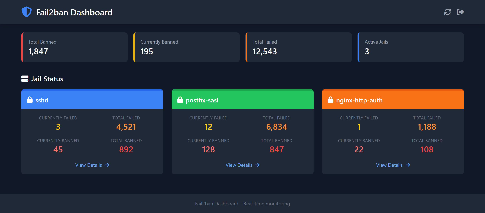
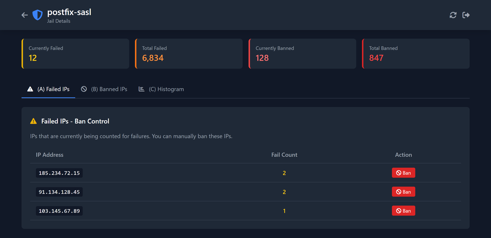

# Fail2ban Dashboard

Fail2banの管理ダッシュボード - BANしたIPの管理を簡単に

## 機能

- **レスポンシブデザイン**: PC・スマホ両対応
- **Jail一覧表示**: グループごとにカード表示
  - Currently Failed: 現在失敗回数をカウント中のIP数
  - Total Failed: 累計失敗数
  - Currently Banned: 現在BANしているIP数
  - Total Banned: 累計BAN数
- **詳細設定画面**:
  - (A) 失敗回数をカウント中のIPをBANするかどうかの設定
  - (B) 現在BANしているIP（Reject回数が多い上位30個）と国の情報
  - (C) Reject回数のヒストグラム表示
- **認証機能**: ログインが必要
- **国情報表示**: IPアドレスから国を自動取得
- **色分け表示**: Jailごとに異なる色で表示

## スクリーンショット

### ダッシュボード
Jail一覧をカード形式で表示。各Jailの状態が一目で分かります。



### 詳細画面
Jailごとの詳細情報を表示。Failed IPs、Banned IPs、ヒストグラムをタブで切り替え。



## アーキテクチャ

```
[Browser]
    ↓ HTTPS (443)
[nginx] ─── リバースプロキシ
    ↓ HTTP (127.0.0.1:8000)
[Flask App] ─── 専用ユーザー(fail2ban-dash)で実行
    ↓ sudo
[fail2ban-client / iptables-save]
```

## 必要要件

- Python 3.8+
- Fail2ban
- nginx
- systemd

---

## クイックスタート（開発用）

ローカルで試す場合：

```bash
# 1. クローン
git clone https://github.com/yourusername/fail2ban-dashboard.git
cd fail2ban-dashboard

# 2. セットアップ
python3 -m venv venv
source venv/bin/activate
pip install -r requirements.txt

# 3. 設定
cp .env.example .env
nano .env  # ADMIN_PASSWORD, SECRET_KEY を変更

# 4. 起動
cd backend
python app.py
```

ブラウザで http://localhost:5000 にアクセス（デフォルト: admin / admin）

---

## 本番環境セットアップ

以下の手順で本番環境を構築します。

### Step 1: 専用ユーザーの作成

セキュリティのため、専用のシステムユーザーを作成します。

```bash
# 専用ユーザーを作成（ログイン不可）
sudo useradd -r -s /sbin/nologin -d /opt/fail2ban-dashboard -m fail2ban-dash
```

| オプション | 説明 |
|-----------|------|
| `-r` | システムアカウント（UID < 1000） |
| `-s /sbin/nologin` | シェルログイン不可 |
| `-d /opt/fail2ban-dashboard` | ホームディレクトリ |
| `-m` | ホームディレクトリを作成 |

### Step 2: アプリケーションのインストール

```bash
# アプリケーションディレクトリに移動
cd /opt/fail2ban-dashboard

# リポジトリをクローン（rootで実行）
sudo git clone https://github.com/yourusername/fail2ban-dashboard.git .

# 仮想環境を作成
sudo python3 -m venv venv

# 依存パッケージをインストール
sudo /opt/fail2ban-dashboard/venv/bin/pip install -r requirements.txt

# 所有者を変更
sudo chown -R fail2ban-dash:fail2ban-dash /opt/fail2ban-dashboard
```

### Step 3: 環境設定

```bash
# 設定ファイルを作成
sudo -u fail2ban-dash cp .env.example .env

# SECRET_KEYを生成
python3 -c "import secrets; print(secrets.token_hex(32))"

# 設定ファイルを編集
sudo nano .env
```

`.env` ファイルの内容：

```bash
# Flask secret key（上で生成した値を設定）
SECRET_KEY=ここに生成したキーを貼り付け

# 管理者認証情報（必ず変更！）
ADMIN_USERNAME=admin
ADMIN_PASSWORD=強力なパスワードを設定

# サーバー設定
FLASK_HOST=127.0.0.1
FLASK_PORT=8000
FLASK_DEBUG=false
```

### Step 4: sudoers設定

専用ユーザーに必要なコマンドの実行権限を付与します。

```bash
sudo visudo
```

以下を追加：

```
# Fail2ban Dashboard
fail2ban-dash ALL=(ALL) NOPASSWD: /usr/bin/fail2ban-client
fail2ban-dash ALL=(ALL) NOPASSWD: /usr/sbin/iptables-save -c
fail2ban-dash ALL=(ALL) NOPASSWD: /usr/bin/tail
fail2ban-dash ALL=(ALL) NOPASSWD: /usr/bin/grep
fail2ban-dash ALL=(ALL) NOPASSWD: /usr/bin/test
```

### Step 5: systemdサービスの設定

```bash
sudo nano /etc/systemd/system/fail2ban-dashboard.service
```

以下の内容を記述：

```ini
[Unit]
Description=Fail2ban Dashboard
After=network.target fail2ban.service

[Service]
Type=simple
User=fail2ban-dash
Group=fail2ban-dash
WorkingDirectory=/opt/fail2ban-dashboard/backend
Environment="PATH=/opt/fail2ban-dashboard/venv/bin"
EnvironmentFile=/opt/fail2ban-dashboard/.env
ExecStart=/opt/fail2ban-dashboard/venv/bin/python app.py
Restart=always
RestartSec=5

# セキュリティ設定
NoNewPrivileges=true
ProtectSystem=strict
ProtectHome=true
ReadWritePaths=/opt/fail2ban-dashboard
PrivateTmp=true

[Install]
WantedBy=multi-user.target
```

サービスを有効化して起動：

```bash
# 設定を再読み込み
sudo systemctl daemon-reload

# 自動起動を有効化
sudo systemctl enable fail2ban-dashboard

# サービスを起動
sudo systemctl start fail2ban-dashboard

# 状態を確認
sudo systemctl status fail2ban-dashboard
```

### Step 6: nginxリバースプロキシの設定

```bash
sudo nano /etc/nginx/conf.d/fail2ban-dashboard.conf
```

以下の内容を記述：

```nginx
server {
    listen 443 ssl http2;
    server_name your-domain.com;  # ドメイン名を変更

    # SSL証明書（Let's Encrypt等）
    ssl_certificate /etc/letsencrypt/live/your-domain.com/fullchain.pem;
    ssl_certificate_key /etc/letsencrypt/live/your-domain.com/privkey.pem;

    # SSL設定
    ssl_protocols TLSv1.2 TLSv1.3;
    ssl_ciphers ECDHE-ECDSA-AES128-GCM-SHA256:ECDHE-RSA-AES128-GCM-SHA256;
    ssl_prefer_server_ciphers off;

    # アクセス制限（必要に応じて）
    # allow 192.168.1.0/24;
    # deny all;

    location / {
        proxy_pass http://127.0.0.1:8000;
        proxy_http_version 1.1;
        proxy_set_header Host $host;
        proxy_set_header X-Real-IP $remote_addr;
        proxy_set_header X-Forwarded-For $proxy_add_x_forwarded_for;
        proxy_set_header X-Forwarded-Proto $scheme;

        # タイムアウト設定
        proxy_connect_timeout 60s;
        proxy_send_timeout 60s;
        proxy_read_timeout 60s;
    }
}

# HTTPからHTTPSへリダイレクト
server {
    listen 80;
    server_name your-domain.com;
    return 301 https://$server_name$request_uri;
}
```

設定をテストして適用：

```bash
# 設定をテスト
sudo nginx -t

# nginxを再読み込み
sudo systemctl reload nginx
```

### Step 7: 動作確認

```bash
# Flaskアプリのログを確認
sudo journalctl -u fail2ban-dashboard -f

# ブラウザでアクセス
# https://your-domain.com
```

---

## トラブルシューティング

### サービスが起動しない

```bash
# ログを確認
sudo journalctl -u fail2ban-dashboard -n 50

# 手動で実行してエラーを確認
sudo -u fail2ban-dash /opt/fail2ban-dashboard/venv/bin/python /opt/fail2ban-dashboard/backend/app.py
```

### Permission denied エラー

```bash
# 所有者を確認
ls -la /opt/fail2ban-dashboard

# 所有者を修正
sudo chown -R fail2ban-dash:fail2ban-dash /opt/fail2ban-dashboard
```

### sudoが動作しない

```bash
# sudoersの設定を確認
sudo -l -U fail2ban-dash

# fail2ban-clientを手動テスト
sudo -u fail2ban-dash sudo /usr/bin/fail2ban-client status
```

---

## API エンドポイント

| エンドポイント | メソッド | 説明 |
|--------------|---------|------|
| `/api/jails` | GET | 全Jailの一覧と状態を取得 |
| `/api/jail/<name>` | GET | 特定Jailの詳細情報を取得 |
| `/api/jail/<name>/histogram` | GET | Reject数のヒストグラムデータを取得 |
| `/api/jail/<name>/ban` | POST | IPをBANする |
| `/api/jail/<name>/unban` | POST | IPのBANを解除する |
| `/api/logs/<name>` | GET | ログからの攻撃情報を取得 |

---

## ディレクトリ構成

```
/opt/fail2ban-dashboard/
├── backend/
│   ├── app.py              # Flask メインアプリ
│   ├── fail2ban_service.py # fail2ban連携
│   ├── geoip_service.py    # 国情報取得
│   └── log_parser.py       # ログ解析
├── templates/
│   ├── index.html          # ダッシュボード
│   ├── detail.html         # 詳細画面
│   └── login.html          # ログイン画面
├── frontend/
│   ├── css/
│   └── js/
├── venv/                   # Python仮想環境
├── .env                    # 環境設定（gitignore）
├── .env.example
├── requirements.txt
└── README.md
```

---

## セキュリティ注意事項

- `.env`ファイルのパスワードとSECRET_KEYは必ず変更してください
- 本番環境では必ずHTTPSを使用してください
- ファイアウォールやnginxでアクセス元を制限することを推奨します
- 専用ユーザー（fail2ban-dash）は最小権限の原則に基づいて設定されています

---

## ライセンス

MIT License
